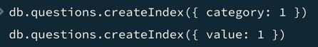
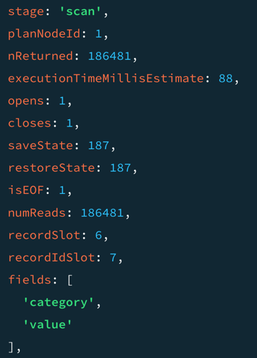

### MongoDB

1) Запустил MongoDB через docker-compose и MongoDB Compas

2) Загрузил датасет с Jeopardy questions

3) Выполнил простой find запрос

4) Выполнил find запрос с сортировкой

5) Выполнил find запрос с логическим оператором в условии

6) Посчитал количество значений по заданному условию

7) Обновил категорию

8) Удалил все записи с определенным значением 

9) Обновил еще несколько полей 

10) Выполнил сложный запрос, чтобы проверить время до добавления индексов

11) Получил время до добавления индексов

12) Добавил индексы

13) После добавления индексов время выполнения запроса немного уменьшилось
