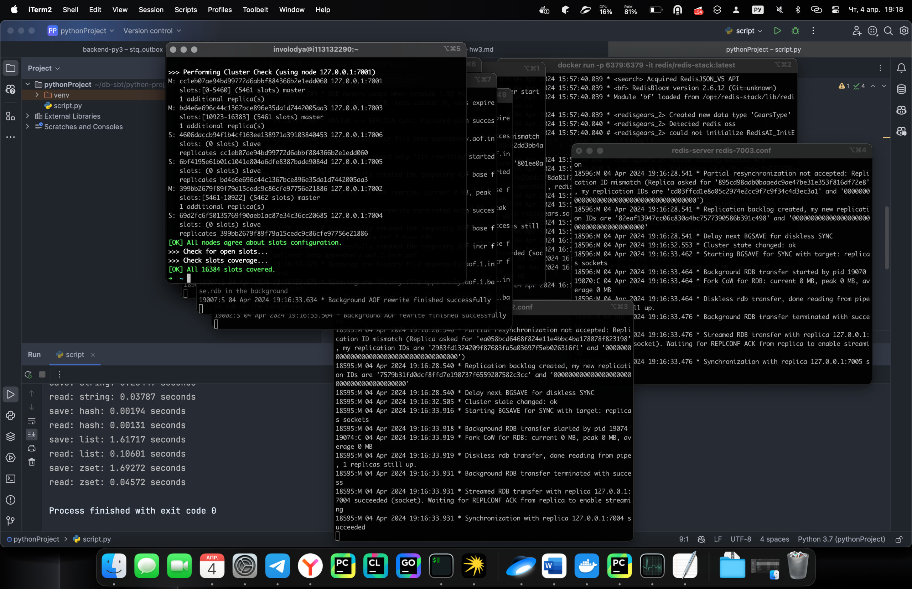

### Redis

1) Устанавливаем redis: `brew install redis`
2) Запускаем сервер: `redis-server`
3) Проверяем его время работы, получаем данные о времени выполнения скриптом:
```
save: string: 0.18227 seconds
read: string: 0.03500 seconds
save: hash: 0.00189 seconds
read: hash: 0.00061 seconds
save: list: 0.80861 seconds
read: list: 0.04742 seconds
save: zset: 0.88979 seconds
read: zset: 0.04467 seconds
```
4) Создаем 6 конфигурационных файлов (3 мастера 3 реплики):
```
port 7001 - 7006
cluster-enabled yes
cluster-config-file nodes_1 - 6.conf
cluster-node-timeout 5000
appendonly yes
```
5) Запускаем их командой `redis-server redis-7001.conf`

6) Проверяем его время работы, получаем данные о времени выполнения скриптом:
```
save: string: 0.19978 seconds
read: string: 0.04320 seconds
save: hash: 0.00187 seconds
read: hash: 0.00147 seconds
save: list: 1.66903 seconds
read: list: 0.06016 seconds
save: zset: 1.69243 seconds
read: zset: 0.05402 seconds
```
Время записи увеличилось в ~2 раза, время чтения незначительно увеличилось 